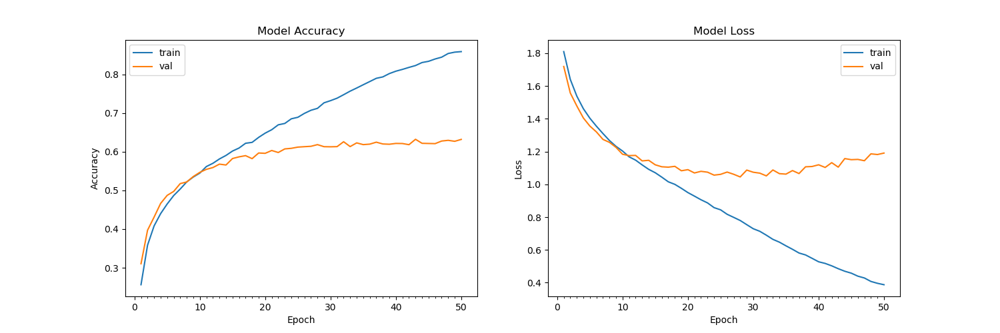

# Emotion Recognition using CNN

This project implements a real-time emotion recognition system using a Convolutional Neural Network (CNN) built with Keras. The model is trained on a dataset of facial expressions and can classify emotions such as Angry, Disgusted, Fearful, Happy, Neutral, Sad, and Surprised.

## Features

- **Trainable Model**: The model can be trained on new data using a pre-defined CNN architecture.
- **Real-time Emotion Detection**: Uses a webcam feed to detect faces and classify emotions in real-time.
- **Interactive Visualization**: Plots model training history to visualize accuracy and loss trends.

## Model Architecture

- **Convolutional Layers**: Multiple Conv2D layers with ReLU activation and MaxPooling for feature extraction.
- **Dense Layers**: Fully connected layers with dropout for regularization.
- **Output Layer**: 7 neurons with softmax activation for emotion classification.

## Prerequisites

- Python 3.x
- Required libraries:
  ```bash
  pip install numpy keras tensorflow opencv-python matplotlib argparse
- Pre-trained model file model.h5 and Haar cascade file haarcascade_frontalface_default.xml should be in the project directory.

## Dataset

The training and validation data should be organized in the following structure:
To properly display the dataset structure in the README file, you can use Markdown code blocks and indentation to represent the folder hierarchy clearly. Here's how to do it:
Dataset Structure in Markdown

markdown

## Dataset Structure

The dataset should be organized into training and validation directories, with subdirectories for each emotion class:

```
data/
  ├── train/
  │   ├── Angry/
  │   ├── Disgusted/
  │   ├── Fearful/
  │   ├── Happy/
  │   ├── Neutral/
  │   ├── Sad/
  │   └── Surprised/
  └── val/
      ├── Angry/
      ├── Disgusted/
      ├── Fearful/
      ├── Happy/
      ├── Neutral/
      ├── Sad/
      └── Surprised/
```

## How to Run

Train the Model (optional):
```bash
python kerasmodel.py --mode train
```
This will train the model using the dataset in the data/train and data/val directories and save the trained model weights as model.h5.

## Display Real-time Emotion Recognition:
```bash
python kerasmodel.py --mode display
```
This will start the webcam feed and display detected emotions in real-time.

## Visualization

To visualize the training history of the model, the plot_model_history() function is provided. It will save the accuracy and loss plots as plot.png.


